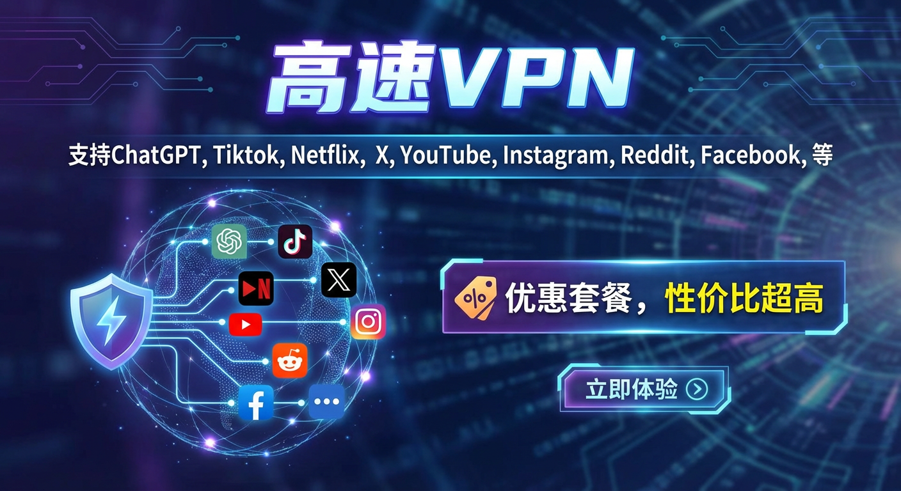
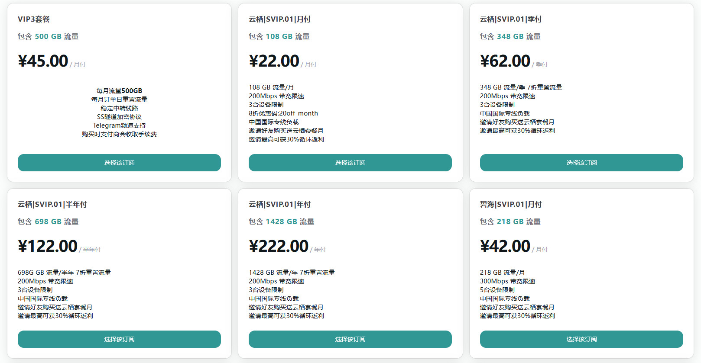

# 2026年最新稳定高速VPN推荐：多款性价比翻墙梯子完全指南

随着网络环境的不断变化，寻找稳定、高速且性价比高的网络访问工具已成为许多用户的刚需。本报告通过对市场上主流VPN和专业网络服务的全面评测，精选了 Bluetile、红杏VPN、等优质VPN服务商，旨在为用户提供全面参考。

### 评选标准与方法论

本报告在评选这些多款工具时，主要考量以下因素：

1. **连接稳定性** - 能否在各种网络环境下保持稳定连接，特别是在网络管控较严格的地区
2. **连接速度** - 是否提供高速连接，支持流媒体观看、在线游戏等高带宽需求
3. **性价比** - 价格与服务质量的平衡，费用结构是否合理
4. **安全性** - 加密标准、隐私政策和数据处理方式
5. **技术支持** - 客户服务响应速度和问题解决能力

#### 选择合适工具的关键考量

在为个人或企业选择合适的网络连接工具时，应综合考虑以下因素：

使用场景与需求分析

不同的使用场景对网络工具有不同的要求。例如：
- 如果主要用于流媒体观看，应选择支持Netflix、Disney+等服务解锁的工具
- 对于商务用户，安全性和稳定性应放在首位
- 对于经常旅行的用户，全球服务器覆盖范围尤为重要

#### 预算与性价比考量

根据个人或企业预算，选择最具性价比的服务：
- 长期使用者可考虑年付或多年套餐，通常有显著折扣
- 对于初次使用者，建议先选择月付套餐进行测试
- 注意关注退款政策，以防服务不符合预期

#### 技术兼容性

确保所选工具与您的设备和网络环境兼容：
- 检查是否支持所有需要使用的设备平台
- 考虑同时连接设备的数量限制
- 评估特殊功能需求，如分割隧道、广告拦截等

---

## Bluetile-VPN

Bluetile是一家专注于提供高速稳定网络服务的机场VPN，以其出色的稳定性、高速网络和高性价比赢得了广泛好评。

**[Bluetile入口](https://www.xn--nly574e.biz/auth/register?code=zI7qvG2n)**

)

---
---
---
---
### 套餐详情介绍
---
- (¥45.00 / 月付)✅  每月流量500GB | 每月订单日重置流量 | 稳定中转线路 | SS隧道加密协议 | Telegram频道支持 | 购买时支付商会收取手续费
---
- (¥22.00 / 月付)✅  108 GB 流量/月 | 200Mbps 带宽限速 | 3台设备限制 | 8折优惠码:20off_month | 中国国际专线负载 | 邀请好友购买送云栖套餐月 | 邀请最高可获30%循环返利
---
- (¥62.00 / 季付)✅  348 GB 流量/季  |  7折重置流量 | 200Mbps 带宽限速 | 3台设备限制 | 中国国际专线负载 | 邀请好友购买送云栖套餐月 | 邀请最高可获30%循环返利
---
- (¥122.00 / 半年付)✅  698G GB 流量/半年  |  7折重置流量 | 200Mbps 带宽限速 | 3台设备限制 | 中国国际专线负载 | 邀请好友购买送云栖套餐月 | 邀请最高可获30%循环返利
---
- (¥222.00 / 年付)✅  1428 GB 流量/年  |  7折重置流量 | 200Mbps 带宽限速 | 3台设备限制 | 中国国际专线负载 | 邀请好友购买送云栖套餐月 | 邀请最高可获30%循环返利
---
- (¥42.00 / 月付)✅  218 GB 流量/月  |  300Mbps 带宽限速  |  5台设备限制  |  中国国际专线负载  |  邀请好友购买送云栖套餐月  |  邀请最高可获30%循环返利
---
- (¥122.00 / 季付)✅  688 GB 流量/季  |  300Mbps 带宽限速  |  5台设备限制  |  中国国际专线负载  |  邀请好友购买送云栖套餐月  |  邀请最高可获30%循环返利
---
- (¥242.00 / 半年付)✅  1448 GB 流量/半年  |  300Mbps 带宽限速  |  5台设备限制  |  中国国际专线负载  |  邀请好友购买送云栖套餐月  |  邀请最高可获30%循环返利
---
- (¥422.00 / 年付)✅   2888 GB 流量/年  |  300Mbps 带宽限速  |  5台设备限制  |  中国国际专线负载  |  邀请好友购买送云栖套餐月  |  邀请最高可获30%循环返利
---
- (¥82.00 / 月付)✅   448 GB 流量/月  |  500Mbps 带宽限速  |  8台设备限制  |  中国国际专线负载  |  邀请好友购买送云栖套餐月,邀请最高可获30%循环返利
---
- (¥242.00 / 季付)✅   1418 GB 流量/季  |  500Mbps 带宽限速  |  8台设备限制  |  中国国际专线负载  |  邀请好友购买送云栖套餐月  |  邀请最高可获30%循环返利
---
- (¥482.00 / 半年付)✅   3018 GB 流量/半年  |  500Mbps 带宽限速  |  8台设备限制  |  中国国际专线负载  |  邀请好友购买送云栖套餐月  |  邀请最高可获30%循环返利
---
- (¥822.00 / 年付)✅      5918 GB 流量/年  |  500Mbps 带宽限速  |  8台设备限制  |  中国国际专线负载  |  邀请好友购买送云栖套餐月  |  邀请最高可获30%循环返利
---
- (¥122.00 / 月付)✅    688 GB 流量/月  |  1000Mbps 带宽限速  |  10台设备限制  |  中国国际专线负载  |  邀请好友购买送云栖套餐月  |  邀请最高可获30%循环返利
---
- (¥362.00 / 季付)✅     2198 GB 流量/季  |  1000Mbps 带宽限速  |  10台设备限制  |  中国国际专线负载  |  邀请好友购买送云栖套餐月  |  邀请最高可获30%循环返利
---
- (¥722.00 / 半年付)✅   4658 GB 流量/半年  |  1000Mbps 带宽限速  |  10台设备限制  |  中国国际专线负载  |  邀请好友购买送云栖套餐月  |  邀请最高可获30%循环返利
---
- (¥1,222.00 / 年付)✅   9088 GB 流量/年  |  1000Mbps 带宽限速  |  10台设备限制  |  中国国际专线负载  |  邀请好友购买送云栖套餐月  |  邀请最高可获30%循环返利
---
- (¥162.00 / 月付)✅    988GB 流量/月  |  15个设备限制  |  1000 M 带宽限速  |  中国国际专线负载  |  邀请好友购买送云栖套餐月
---
- (¥482.00 / 季付)✅    3118GB流量/季  |  15个设备限制  |  1000 M 带宽限速  |  中国国际专线负载  |  邀请好友购买送云栖套餐月
---
- (¥962.00 / 半年付)✅    6548GB 流量/半年  |  15个设备限制  |  1000 M 带宽限速  |  中国国际专线负载  |  邀请好友购买送云栖套餐月
---
- (¥1,622.00 / 年付)✅   13048GB 流量/年  |  15个设备限制  |  1000 M 带宽限速  |  中国国际专线负载  |  邀请好友购买送云栖套餐月
---
- (¥1,116.00 / 月付)✅   3888GB 流量/月  |  无设备限制  |  无带宽限速  |  中国国际专线负载  |  企业365X18H客服  |  企业专项技术支援
---
- (¥3,176.00 / 季付)✅    11888GB 流量/季  |  无设备限制  |  无带宽限速  |  中国国际专线负载  |  企业365X18H客服  |  企业专项技术支援  |  增值税普通发票
---
- (¥6,576.00 / 半年付)✅    25888GB 流量/半年  |  无设备限制  |  无带宽限速  |  中国国际专线负载  |  企业365X18H客服  |  企业专项技术支援  |  增值税普通发票
---
- (¥12,776.00 / 年付)✅    52888GB 流量/年  |  无设备限制  |  无带宽限速  |  中国国际专线负载  |  企业365X18H客服  |  企业专项技术支援  |  增值税普通发票

---
---
---
- **流媒体解锁**：支持解锁ChatGPT、YouTube、Netflix等流媒体，提供8K视频观看体验。
- **跨境专线**：全域企业级跨境专线，特别是在特殊时期保持稳定，高峰时段网速有保障。
- **全球覆盖**：节点覆盖30+全球边缘地区，确保用户在不同地区都能获得稳定的连接。
- **客户服务**：24小时在线客服支持，提供快速响应的技术帮助。

- **性价比高**：价格亲民，适合预算有限的用户，获得高性价比的网络服务。
- **稳定性高**：采用先进技术，确保网络连接稳定，适合长期使用。
- **复购率高**：深受用户喜爱，复购率很高，表明其服务质量和用户满意度。

- **私密性强**：提供高速、私密的网络服务，适合外贸公司、科研人员和科技博主等用户。

- **客户端支持**：自研专属客户端，操作简单，适合新手用户使用。

**套餐选购建议**

1. 轻度使用者（主要浏览网页、使用ChatGPT）建议选择轻量版月付或特惠限量年付套餐
2. 中度使用者（经常观看流媒体）建议选择特惠限量专业版年付，性价比最高
3. 重度使用者（需要多设备同时在线、大量观看高清流媒体）建议选择专业版年付套餐

所有套餐均支持ChatGPT、Netflix、Hulu等流媒体服务，且不限制端口速率

## [BluetileVPN]线路原生支持解锁流媒体，内容包括 Netflix、Disney、HBO、TVB、Happyon、AbemaTV 等在内的多种流媒体视频。

全线路 IEPL 跨境专线出国 1000Mbps峰值速率 入口接入，自建全线路IEPL专线接入保证稳定节点倍率1。Netflix、動畫瘋、HBO、Disney+、等流媒體解鎖，支持UDPN、NginX+TLS、SecureX安全隧道加密協議线路100%匿名。

节点采用顶级线路最新加密技术集群防封敏感时期一样畅通无阻，海外团队运营安全，注册时候随便填写邮箱，邮箱没有验证 不会收集任何个人隐私。。

---
---
---
---
---
---

---
## [红杏-VPN](./images/0002.png)

** 红杏-VPN 是一家专为中国用户精心优化的高质量网络加速服务提供商，主打稳定高速的中继节点体验，支持多平台自动配置，无需繁琐设置，轻松实现全设备无障碍上网。

通过红杏-VPN，用户可轻松访问被限制的网站与服务，包括 **YouTube、Netflix、Disney+、ChatGPT** 等热门平台，告别网络壁垒，畅享全球内容。

**访问官网**：点击下方链接进入
- [ ** 红杏-VPN官网地址入口1**](https://www.xn--8qv123c.co/auth/register?code=DadT8U4s)
- [ ** 红杏-VPN官网地址入口2**](https://hx666.02000.xin/auth/register?code=DadT8U4s)

🚀 **红杏-VPN服务亮点**：

- **BGP 三网优化 + 深港内网专线**：覆盖热门地区节点，同时提供冷门区域及游戏专用节点，兼顾速度与多样性  
- **全球优质线路 50+**：适配追剧爱好者、社交达人、跨境学习者等多类用户场景  
- **支持所有主流平台**：一键导入配置，快速上手无门槛  
- **新用户专享体验**：注册即享 24 小时试用，无风险体验服务质量

### 套餐详情介绍

| 分类           | 名称 | 价格       | 流量  | 带宽  | 设备 | 节点质量 | 是否限时 | 特点说明           | 推荐指数 |
| -------------- | ---- | ---------- | ----- | ----- | ---- | -------- | -------- | ------------------ | -------- |
| 3周年特惠 年付     | Max | 6,388元/年   | 6888 GB/年  | 无带宽限制 | 无设备限制 | 国际专线负载  | 适合企业级用户使用 | 国际专线负载  |⭐⭐⭐⭐⭐⭐        |
| 月付      | 小杯 | ¥18/月   | 80GB流量/月  | 100 MB  | 2台  | 高速传输  | 是  | 独有EIP高速传输  | 个人用户使用  |  ⭐⭐⭐        | 
---
| 季付|小杯|¥54/季|80GB流量/月|100 MB|2台|高速传输|是|独有EIP高速传输|个人用户使用| ⭐⭐⭐       |
---
| 半年付|小杯|¥100/半年|80GB流量/月|200 MB|2台|高速传输|是|独有EIP高速传输|个人用户使用| ⭐⭐⭐       |
---
| 年付|小杯|¥180/年|80GB流量/月|500 MB|2台|高速传输|是|独有EIP高速传输|个人用户使用| ⭐⭐⭐       |
---
| 月付|小杯|¥25/月|150GB流量/月|200 MB|2台|高速传输|是|独有EIP高速传输|个人用户使用| ⭐⭐⭐       |
---
| 季付|小杯|¥70/季|150GB流量/月|200 MB|2台|高速传输|是|独有EIP高速传输|个人用户使用| ⭐⭐⭐       |
---
| 半年付|小杯|¥135/半年|150GB流量/月|100 MB|2台|高速传输|是|独有EIP高速传输|个人用户使用| ⭐⭐⭐       |
---
| 年付|小杯|¥255/年|150GB流量/月|1000 MB|2台|高速传输|是|独有EIP高速传输|个人用户使用| ⭐⭐⭐       |
---
| 月付|小杯|¥35/月|300GB流量/月|350 MB|4台|高速传输|是|独有EIP高速传输|个人用户使用| ⭐⭐⭐       |
---
| 季付|小杯|¥100/季|300GB流量/月|350 MB|4台|高速传输|是|独有EIP高速传输|个人用户使用| ⭐⭐⭐       |
---
| 半年付|小杯|¥180/半年|300GB流量/月|350 MB|4台|高速传输|是|独有EIP高速传输|个人用户使用| ⭐⭐⭐       |
---
其它更多套餐详情见：[ ** 红杏-VPN官网**](https://www.xn--8qv123c.co/auth/register?code=DadT8U4s)
---
---
---
线路有 IEPL 和 IPLC 专线，对 Netflix、Disney+ 流媒体解锁支持度也很好。有定制的一键翻墙-VPN客户端，支持安卓、Mac 和 Windows ，iOS 用户推荐使用 Shadowrocket 小火箭代理软件。

- 流媒体全解锁：支持Netflix、Disney+等主流流媒体平台的全解锁，满足您的观影需求。
- 无限制设备数：不限制使用本人设备数量，一账号，全家共享。
- 低延迟游戏加速：为游戏爱好者提供低延迟的游戏加速服务，享受流畅的游戏体验。
- 额外的备用线路：为保证服务稳定性，额外提供备用线路，确保连接不中断。
- 全线路支持：用户可以根据需要自由选择任何线路，灵活性高。
- 峰值速率高达1000Mbps：提供高速的网络连接，满足您的高速上网需求。

---
---
---
---

### 邀请系统升级,你邀请我送套餐!

邀请系统现已上线。即日起，邀请亲友注册并首次购买任意套餐，即可获得额外奖励时长。

奖励规则说明：

我们以【轻纱 套餐】为标准（价值 ¥18/月，可获得 15 天奖励）。

若亲友购买的套餐价格高于轻度 Access，将按照价值比例进行折算，并按你当前套餐的单价计算等额时长奖励。

示例说明：

* 你当前使用套餐 A，价值 ¥30/月

* 亲友注册并首次购买后，奖励价值 18 元

* 奖励折算：18 ÷ 30 × 15 = 9 元 → 你将获得 30 ÷ 30 × 9 元 =9 天 A 套餐时长(购买在x2)

额外奖励说明：

* 所有邀请注册的用户均可获得

* 邀请人还可获得被邀请人消费金额的 20% 作为返利（可提现或站内抵扣）

商务合作额外奖励：

如你能促成联合抽奖、广告投放、与网站、UP主、博客等平台达成推广合作，我们将视情况直接赠送你【轻纱 套餐】1年订阅作为感谢。

所有奖励均由系统自动计算并发放，无需手动申领。

###  安全使用网络工具的注意事项

在使用网络连接工具时，应当了解并遵守当地的法律法规。不同国家和地区对这类工具的使用有不同规定，用户应确保自己的行为合法合规。

 #### 隐私保护措施

保护个人隐私是使用网络工具时的重要考量：
- 选择无日志政策的服务提供商
- 避免在连接时进行敏感操作，如银行交易
- 定期更新客户端软件，确保安全漏洞得到修复

#### 账户安全

保护您的账户安全同样重要：
- 使用强密码并定期更换
- 开启双因素认证（如有提供）
- 避免在不安全的网络环境下登录账户

#### 选购服务时的实用建议：

- 优先考虑提供试用期或退款保证的服务
- 初次使用建议先购买短期套餐进行评估
- 注意辨别虚假宣传，不要轻信"100%安全"等绝对化承诺
- 选择有良好声誉和用户评价的服务提供商

#### 技术问题处理

使用过程中可能遇到的常见技术问题及解决方案：

- 连接失败：尝试更换服务器或协议，检查本地网络设置
- 速度慢：测试不同服务器，避开高峰时段，确认本地网络状况
- 应用兼容性问题：使用分割隧道功能，或检查应用特定设置
- 定期清理缓存和Cookie，改善整体使用体验

### 敏感时期特别提示

在某些特殊时期（如重大会议或节日期间），网络管控可能会加强，连接工具的稳定性可能受到影响。建议用户在这些时期：

- 提前测试并准备多种备选方案
- 关注服务提供商的官方通知和更新
- 适当降低对网络稳定性的期望
- 避免在关键工作时段过度依赖这些工具

本报告介绍的多款工具各有特色，覆盖了从高端商务到经济实惠的多种选择，用户可根据自身需求和预算做出明智选择。

值得强调的是，这些工具的主要价值在于提供安全、私密的网络环境和稳定、高速的连接体验。在使用过程中，请务必遵守当地法律法规，保持负责任的网络行为。随着技术的不断进步，我们有理由期待未来会出现更加高效、安全的网络连接解决方案，为全球互联网用户带来更优质的体验。
